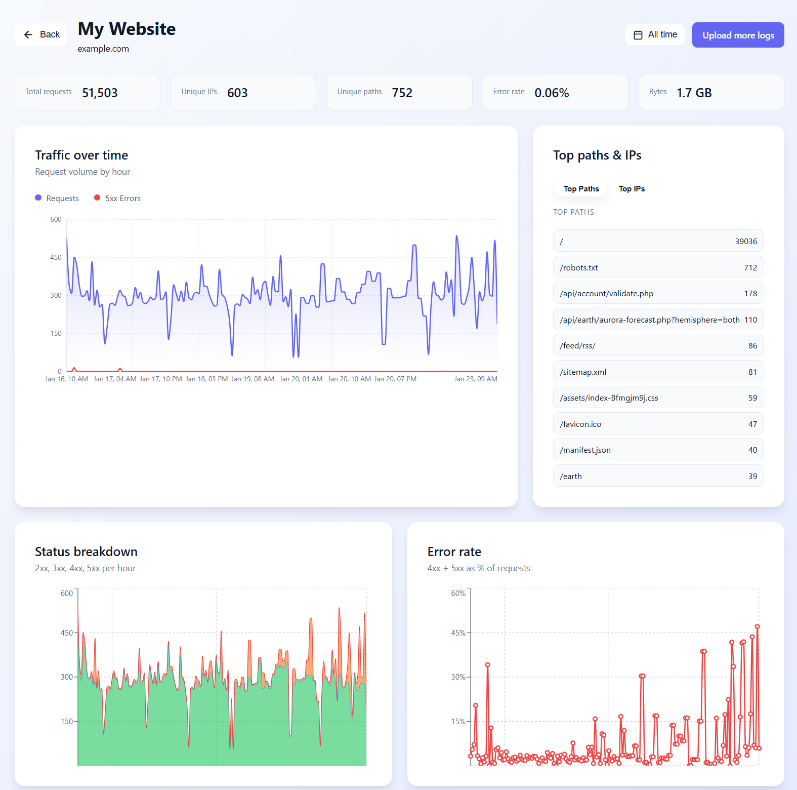
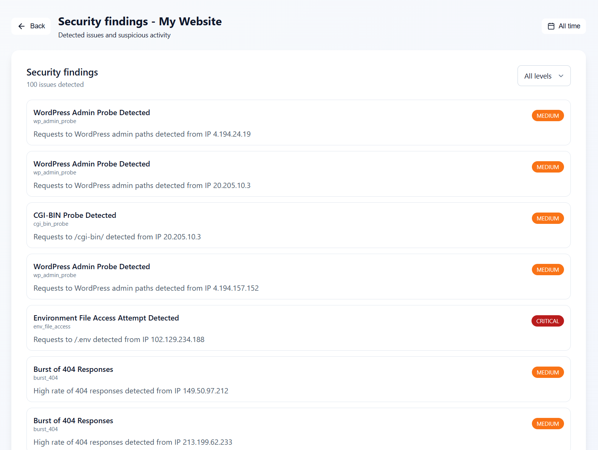
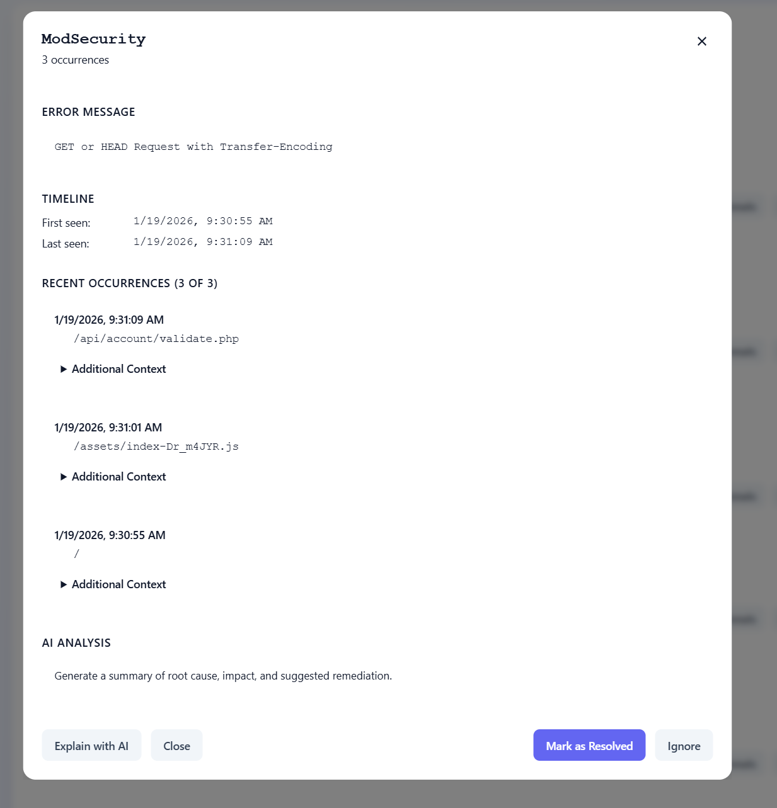
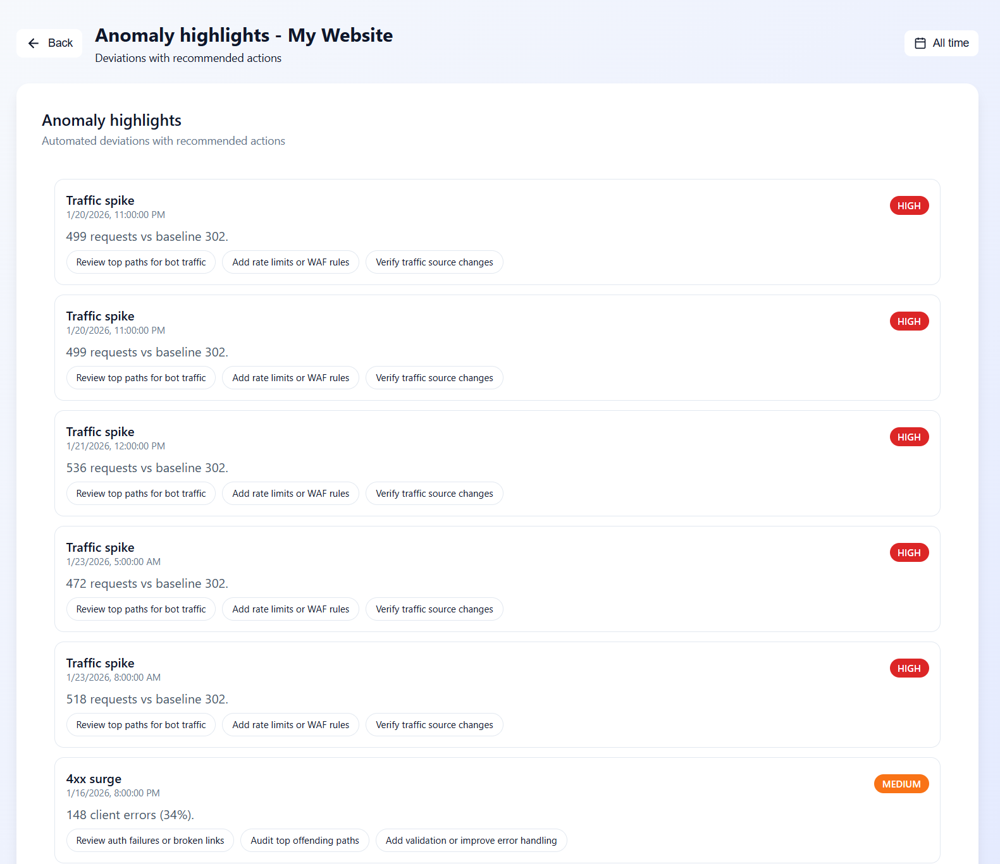

# Logamizer

A lightweight log insight and security signal SaaS tool that turns raw access/error logs into clear signals, explanations, and actionable next steps.

## Features

- **Log Ingestion**: Upload Apache/Nginx access and error logs
- **Parsing & Normalization**: Structured event extraction with quality metrics
- **Security Signals**: Rule-based detection for scanning, abuse, and misconfigurations
- **Anomaly Detection**: Statistical baseline comparison for traffic and error spikes
- **LLM Explanations**: Ollama-powered insights grounded in computed facts (optional)

## Screenshots









## Demo data (recommended)

For a quick “show me” path, add a small, anonymized sample log set and a demo script.

- samples/
      - access.log
      - error.log
- scripts/demo.sh

Example goal:

```bash
./scripts/demo.sh
```

…which should create a demo site, ingest sample logs, and open the dashboard.

## Architecture

```
┌─────────────┐     ┌─────────────┐     ┌─────────────┐
│   frontend  │────>│     api     │────>│   worker    │
│   (React)   │     │  (FastAPI)  │     │  (Celery)   │
└─────────────┘     └──────┬──────┘     └──────┬──────┘
                          │                    │
                    ┌─────▼─────┐        ┌─────▼─────┐
                    │  postgres │        │   redis   │
                    └───────────┘        └───────────┘
                          │
                    ┌─────▼─────┐        ┌───────────┐
                    │   minio   │        │  ollama   │
                    └───────────┘        └───────────┘
```

## Quick Start

### Prerequisites

- Docker and Docker Compose
- Git

### Setup

```bash
# Clone the repository
git clone https://github.com/ryanlane/logamizer.git
cd logamizer

# Copy environment file
cp .env.example .env

# Start all services
docker-compose -f infra/docker-compose.yml up -d

# Run migrations
docker-compose -f infra/docker-compose.yml exec api alembic -c infra/migrations/alembic.ini upgrade head
```

### Access

- **API**: http://localhost:8000
- **API Docs**: http://localhost:8000/docs
- **MinIO Console**: http://localhost:9001 (minioadmin/minioadmin)

## Safety & Scope (live verification)

The endpoint `POST /api/findings/{finding_id}/verify` performs live verification probes.
To keep usage safe and compliant, verification should be limited to domains owned by the
site owner (or explicitly allow-listed). Rate limits, timeouts, and safe user‑agent
settings are strongly recommended. If you plan to enable probes by default, document
the scope and safeguards here.

## Parsing Contract

Document supported formats, normalization rules, and quality metrics in:

- docs/parsing.md

## API Endpoints

### Authentication
- `POST /api/auth/register` - Register new user
- `POST /api/auth/login` - Login and get tokens
- `POST /api/auth/refresh` - Refresh access token
- `GET /api/auth/me` - Get current user

### Sites
- `GET /api/sites` - List all sites
- `POST /api/sites` - Create a site
- `GET /api/sites/{id}` - Get site details
- `PUT /api/sites/{id}` - Update site
- `DELETE /api/sites/{id}` - Delete site

### Uploads
- `POST /api/sites/{id}/upload-url` - Get presigned upload URL
- `POST /api/sites/{id}/uploads` - Confirm upload and start processing
- `GET /api/sites/{id}/log-files` - List uploaded log files

### Jobs
- `GET /api/jobs/{id}` - Get job details
- `GET /api/jobs/{id}/status` - Get job status (for polling)
- `GET /api/jobs` - List all jobs

### Findings
- `GET /api/sites/{id}/findings` - List findings for a site
- `GET /api/sites/{id}/findings/{finding_id}` - Get a single finding
- `POST /api/findings/{finding_id}/verify` - Verify a finding with live probes

### Explain
- `POST /api/sites/{id}/explain` - Explain findings/anomalies with Ollama

## Development

### Project Structure

```
logamizer/
├── apps/
│   ├── api/          # FastAPI backend
│   └── worker/       # Celery worker
│   └── frontend/     # React + Vite frontend
├── packages/
│   └── shared/       # Shared types and constants
├── infra/
│   ├── docker-compose.yml
│   ├── Dockerfile.api
│   ├── Dockerfile.worker
│   └── migrations/   # Alembic migrations
├── scripts/
│   └── setup.sh
└── tests/
```

### Running in Development Mode

```bash
# Start with hot reload
docker-compose -f infra/docker-compose.yml -f infra/docker-compose.dev.yml up
```

### Frontend (React + Vite)

```bash
# Install frontend dependencies
cd apps/frontend
npm install

# Start the dev server
npm run dev
```

### Running Tests

```bash
# Install dev dependencies
pip install -e ".[dev]"

# Run tests
pytest
```

## Tech Stack

- **Backend**: Python 3.12, FastAPI, SQLAlchemy 2.x, Celery
- **Frontend**: React 18, TypeScript, Vite, TanStack Query, Recharts, CSS Modules
- **Database**: PostgreSQL 16
- **Queue**: Redis 7
- **Storage**: MinIO (S3-compatible)
- **Auth**: JWT with refresh tokens

## Roadmap

- [x] Phase 1: Foundations (Auth, Sites, Uploads, Jobs)
- [x] Phase 2: Log Parsing (Nginx/Apache combined formats)
- [x] Phase 3: Security Signals (Rule-based detection)
- [x] Phase 4: Anomaly Detection (Statistical baselines)
- [x] Phase 5: Ollama Integration (LLM explanations)
- [x] Phase 6: React Frontend

## Contributing & Security

Recommended repo hygiene files:

- CONTRIBUTING.md
- SECURITY.md
- CODE_OF_CONDUCT.md (optional)

## CI

Recommended checks:

- Backend: ruff, mypy/pyright, pytest
- Frontend: eslint, tsc, build

## License

MIT
